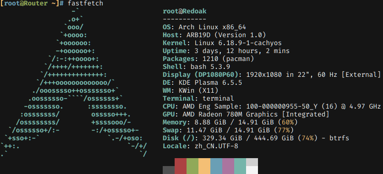

# OS Terminal

A `no_std` terminal library for embedded systems and OS kernels.

The environment should have initialized `global_allocator` since `alloc` crate is used for dynamic memory allocation.

## Screenshot



This screenshot shows the result of running `fastfetch` in the example terminal. You can try it by running `cargo run --example terminal` (Linux only). It will execute `bash` by default.

## Features

- Embedded smooth noto sans mono font rendering
- Truetype font support
- VT100 and part of xterm escape sequence support
- Beautiful color scheme
- Cursor display and shape control

## Usage

Create a display wrapper to wrap your framebuffer and implement the `DrawTarget` trait for it.

```rust
use alloc::boxed::Box;
use os_terminal::{DrawTarget, Rgb888, Terminal};
use os_terminal::font::BitmapFont;

struct Display {
    width: usize,
    height: usize,
    buffer: &'static [u32],
}

impl DrawTarget for Display {
    fn size(&self) -> (usize, usize) {
        (self.width, self.height)
    }

    #[inline(always)]
    fn draw_pixel(&mut self, x: usize, y: usize, color: Rgb888) {
        let value = (color.0 as u32) << 16 | (color.1 as u32) << 8 | color.2 as u32;
        self.buffer[y * self.width + x] = value;
    }
}
```

Then you can create a terminal with a box-wrapped font manager, and write to it.

```rust
let mut terminal = Terminal::new(display);
terminal.set_font_manager(Box::new(BitmapFont));
terminal.write_bstr(b"\x1b[31mHello, world!\x1b[0m");
terminal.write_fmt(format_args!("{} + {} = {}", 1, 2, 3));
```

To use truetype font, enable `truetype` feature and create a `TrueTypeFont` instance from a font file with size.

```rust
let font_buffer = include_bytes!("NotoSansMono-Regular.ttf");
terminal.set_font_manager(Box::new(TrueTypeFont::new(14.0, font_buffer)));
```

Notice that you are supposed to use a variable-font-supported ttf file otherwise font weight will not change.

If you want to get the logs from the terminal, you can set a logger that receives `fmt::Arguments`.

```rust
os_terminal::set_logger(|args| println!("Terminal: {:?}", args));
```

Default flush strategy is synchronous. If you need higher performance, you can disable the auto flush and flush manually when needed.

```rust
terminal.set_auto_flush(false);
terminal.flush();
```

## Features

- `bitmap`: Enable embedded noto sans mono bitmap font support. This feature is enabled by default.
- `truetype`: Enable truetype font support. This feature is disabled by default.

## Acknowledgement

- [embedded-term](https://github.com/rcore-os/embedded-term): This project is a fork of it with some simplifications and improvements.
- [alacritty](https://github.com/CyberFlameGO/alacritty): General reference for the terminal implementation.
- [noto-sans-mono-bitmap-rs](https://github.com/phip1611/noto-sans-mono-bitmap-rs): Pre-rasterized smooth characters.

Thanks to the original author and contributors for their great work.
